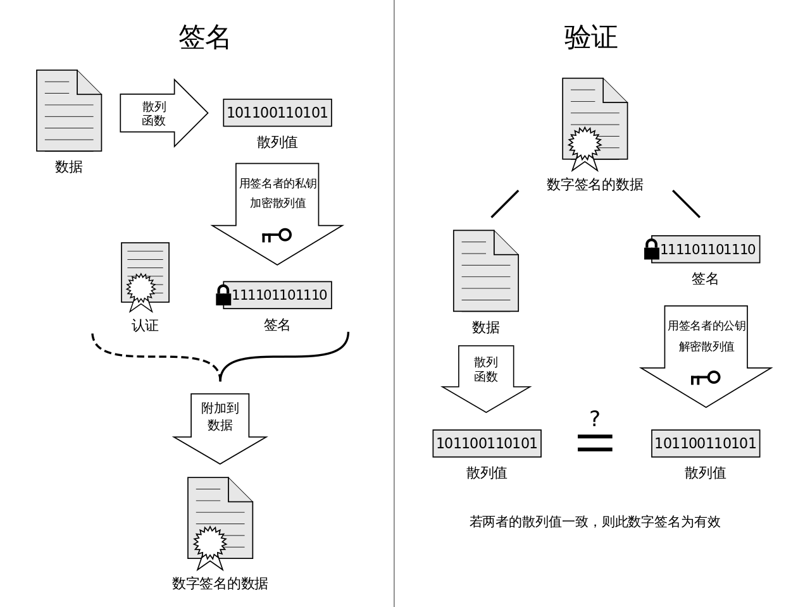

# about-crypto
## 密码学工具

## 对称密码

## 公钥密码

## 单向散列函数One-way hash function（或称消息摘要、哈希函数、杂凑函数）

- 函数性质
- 函数类型：
  MD4、MD5、SHA-1、SHA-256、SHA-384、SHA-512、SHA-3等
- 函数弱点：
    - ”抗碰撞性“攻击
        1. 对“弱抗碰撞性”的攻击主要是利用消息的冗余性生成具有相同散列值的另一个消息，这种攻击也是暴力破解，每次都稍微改变一下消息的值，然后对这些消息求散列值。在这种情况下，暴力破解需要尝试的次数可以根据散列值的长度计算出来。以SHA-1为例，由于它的散列值长度为160比特，因此最多只要尝试2^160次就能够找到目标消息。由于尝试次数纯粹是由散列值长度决定的，因此散列值长度越长的单向散列函数，其抵御暴力破解的能力也就越强。
        2. 对“强抗碰撞性”的攻击一般称为 生日攻击 。生日攻击不是寻找生成特定散列值的消息，而是要找到相同散列值的两条消息，而散列值则可以是任何值。生日攻击的原理来自生日悖论，也就是利用了“任意散列值一致的概率比想象中高”这样的特性。相对于暴力破解，生日攻击所需尝试的次数要少得多，一般只需要是暴力破解的一般。
  
- 函数缺陷：
    单向散列函数可以实现完整性的检查，但却**识别不了"伪装"**，即无法解决认证问题。认证问题需要使用**消息认证码**和**数字签名**来解决。

## 消息认证码MAC

- 攻击：
    - 共享秘钥，是否有安全的渠道分发
## 数字签名

## 伪随机数生成器